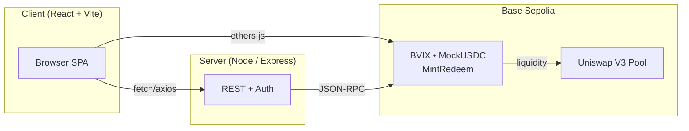

# Levitas Protocol

> **Mission** – Build the volatility layer of DeFi. Tokenize crypto native, fully collateralized and composable volatility indices on-chain.
> Mint synthetic volatility, trade it permissionlessly, and earn fees by supplying liquidity – all on Base Sepolia today.

---

## Architecture




### Deployed contracts (Base Sepolia)

| Name | Address | Explorer |
|------|---------|----------|
| Mock USDC | `0x79640e0F510A7C6d59737442649D9600C84B035f` | https://sepolia.basescan.org/address/0x79640e0F510A7C6d59737442649D9600C84B035f |
| BVIX | `0xEA3d08A5A5bC48Fc984F0F773826693B7480bF48` | https://sepolia.basescan.org/address/0xEA3d08A5A5bC48Fc984F0F773826693B7480bF48 |
| MintRedeem | `0x27F971cb582BF9E50F397e4d29a5C7A34f11faA2` | https://sepolia.basescan.org/address/0x27F971cb582BF9E50F397e4d29a5C7A34f11faA2 |
| Uniswap V3 Pool (0.05 %) | `0x7883Ba215Bd4C8d81Ed8643e6CA7F15659fDD190` | https://sepolia.basescan.org/address/0x7883Ba215Bd4C8d81Ed8643e6CA7F15659fDD190 |

---

### Quick-start (local)

```bash
git clone https://github.com/iamguerrero/levitas-protocol.git
cd levitas-protocol
pnpm install          # or: yarn / npm i
pnpm dev              # Express + Vite on http://localhost:5000

© 2025 Levitas Labs – MIT

🌐 dApp: https://levitas.replit.app
📝 White-paper: https://levitas.replit.app/Levitas%20Finance%20Whitepaper%20V1.pdf
🐦 X: @levitasfinance
💬 Discord:https://discord.gg/dE5wV8Deya

### Contract status

| Contract | Address | Explorer | Status |
|----------|---------|----------|--------|
| **BVIXToken** | [`0xEA3d…bF48`](https://sepolia.basescan.org/address/0xEA3d08A5A5bC48Fc984F0F773826693B7480bF48) | BaseScan |  |
| **Mock USDC** | [`0x7964…b035f`](https://sepolia.basescan.org/address/0x79640e0F510A7C6D59737442649D9600C84B035f) | BaseScan |  |
| **MintRedeem (Vault)** | [`0x184D…b806`](https://sepolia.basescan.org/address/0x184D28dc8AA2E1069e47650DE028Dbb34C5Cb806) | BaseScan |  |
| **Uniswap V3 Pool** | [`0x7883…d190`](https://sepolia.basescan.org/address/0x7883Ba215Bd4C8d81eD8643E6cA7F15659fDd190) | BaseScan | – |
