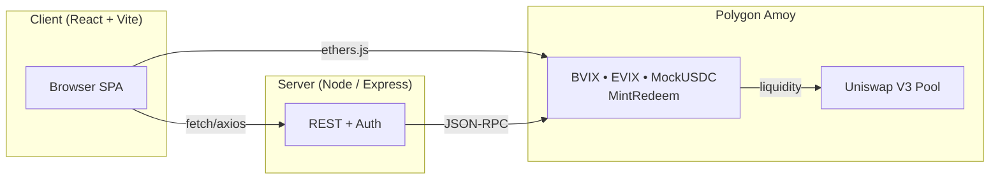

# Levitas Protocol

[](https://sepolia.basescan.org/address/0x79640e0F510A7C6d59737442649D9600C84B035f)
[](https://sepolia.basescan.org/address/0xEA3d08A5A5bC48Fc984F0F773826693B7480bF48)
[](https://sepolia.basescan.org/address/0x27F971cb582BF9E50F397e4d29a5C7A34f11faA2)

> **Mission** – Build the volatility layer of DeFi. Tokenize crypto-native, fully collateralized and composable volatility indices on-chain.  
> Mint synthetic volatility, trade it permissionlessly, and earn fees by supplying liquidity – all on **Polygon Amoy** today.

---

## Architecture



### Deployed contracts (Polygon Amoy)

| Name | Address | Explorer |
|------|---------|----------|
| Mock USDC | `0x0000000000000000000000000000000000000000` | https://amoy.polygonscan.com/address/0x0000000000000000000000000000000000000000 |
| BVIX | `0x0000000000000000000000000000000000000000` | https://amoy.polygonscan.com/address/0x0000000000000000000000000000000000000000 |
| EVIX | `0x0000000000000000000000000000000000000000` | https://amoy.polygonscan.com/address/0x0000000000000000000000000000000000000000 |
| BVIX Oracle | `0x0000000000000000000000000000000000000000` | https://amoy.polygonscan.com/address/0x0000000000000000000000000000000000000000 |
| EVIX Oracle | `0x0000000000000000000000000000000000000000` | https://amoy.polygonscan.com/address/0x0000000000000000000000000000000000000000 |
| BVIX MintRedeemV7 | `0x0000000000000000000000000000000000000000` | https://amoy.polygonscan.com/address/0x0000000000000000000000000000000000000000 |
| EVIX MintRedeemV7 | `0x0000000000000000000000000000000000000000` | https://amoy.polygonscan.com/address/0x0000000000000000000000000000000000000000 |

---

### Quick-start (local)

```bash
git clone https://github.com/iamguerrero/levitas-protocol.git
cd levitas-protocol
pnpm install            # or yarn / npm i
pnpm dev                # Express + Vite on http://localhost:5000
```

© 2025 Levitas Labs – MIT

🌐 dApp&nbsp; <https://levitas.replit.app>  
📝 White-paper&nbsp; <https://levitas.replit.app/Levitas%20Finance%20Whitepaper%20V1.pdf>  
🐦 X&nbsp; [@levitasfinance](https://twitter.com/levitasfinance)  
💬 Discord&nbsp; <https://discord.gg/dE5wV8Deya>

