# Levitas Finance

[](https://opensource.org/licenses/MIT)
[](https://sepolia.basescan.org/)
[](https://levitas.finance)

**Build the volatility layer of DeFi**  
Tokenized crypto-native volatility indices with full collateralization, advanced liquidation mechanics, and permissionless trading on Base Sepolia.

## 🚀 Features

- **Dual Volatility Tokens**: BVIX (Bitcoin volatility) and EVIX (Ethereum volatility) 
- **Advanced Liquidation System**: 120% liquidation threshold with 5% liquidator bonuses
- **Real-Time Price Oracles**: Live price feeds with 10-second refresh intervals
- **Vault Management**: Individual position tracking with collateral ratio monitoring
- **Performance Optimized**: Sub-3 second loading times with intelligent caching
- **Security Audited**: Vault-aware redemption protecting against free USDC vulnerabilities

---

## Architecture

```mermaid
flowchart LR
  %% ---------- Front-end ----------
  subgraph Client ["Client (React + Vite)"]
    A[Browser SPA]
  end

  %% ---------- Back-end ----------
  subgraph Server ["Server (Node / Express)"]
    B[REST + Auth]
  end

  %% ---------- Blockchain ----------
  subgraph "Base Sepolia"
    C["BVIX • EVIX • MockUSDC<br/>MintRedeem"]
    D["Uniswap V3 Pool"]
  end

  A -- ethers.js --> C
  A -- fetch/axios --> B
  B -- JSON-RPC --> C
  C -- liquidity --> D
```



## 📋 Smart Contracts (Production V8/V6)

| Contract | Address | Version | Status |
|----------|---------|---------|--------|
| **BVIX Token** | [`0x7223A0Eb07B8d7d3CFbf84AC78eee4ae9DaA22CE`](https://sepolia.basescan.org/address/0x7223A0Eb07B8d7d3CFbf84AC78eee4ae9DaA22CE) | V8 | ✅ Production |
| **BVIX MintRedeem** | [`0x653A6a4dCe04dABAEdb521091A889bb1EE298D8d`](https://sepolia.basescan.org/address/0x653A6a4dCe04dABAEdb521091A889bb1EE298D8d) | V8 | ✅ Production |
| **BVIX Oracle** | [`0xA6FAC514Fdc2C017FBCaeeDA27562dAC83Cf22cf`](https://sepolia.basescan.org/address/0xA6FAC514Fdc2C017FBCaeeDA27562dAC83Cf22cf) | V8 | ✅ Production |
| **EVIX Token** | [`0x7066700CAf442501B308fAe34d5919091e1b2380`](https://sepolia.basescan.org/address/0x7066700CAf442501B308fAe34d5919091e1b2380) | V6 | ✅ Production |
| **EVIX MintRedeem** | [`0x6C3e986c4cc7b3400de732440fa01B66FF9172Cf`](https://sepolia.basescan.org/address/0x6C3e986c4cc7b3400de732440fa01B66FF9172Cf) | V6 | ✅ Production |
| **EVIX Oracle** | [`0xBd6E9809B9608eCAc3610cA65327735CC3c08104`](https://sepolia.basescan.org/address/0xBd6E9809B9608eCAc3610cA65327735CC3c08104) | V6 | ✅ Production |
| **Mock USDC** | [`0x9CC37B36FDd8CF5c0297BE15b75663Bf2a193297`](https://sepolia.basescan.org/address/0x9CC37B36FDd8CF5c0297BE15b75663Bf2a193297) | - | ✅ Testnet |

### 🛡️ Security Features
- **Vault-Aware Redemption**: Users can only redeem tokens up to their vault debt amount
- **Liquidation Protection**: 120% collateral ratio threshold with 5% liquidator bonuses  
- **Position Isolation**: Fresh vault detection after liquidation events
- **Fee Structure**: 0.30% mint/redeem fees for sustainable protocol revenue

## 🛠️ Development Sprints

### ✅ Sprint 1: Core Security & Access Control (Completed)
- Access control with role-based permissions (GOVERNOR, PAUSER, LIQUIDATOR)
- Pause mechanisms for emergency situations
- Reentrancy guards on critical functions
- Comprehensive liquidation mechanics with 5% bonuses

### ✅ Sprint 2.1: Real-Time Price System (Completed) 
- Live oracle price feeds updating every 10 seconds
- Vault health monitoring with real-time collateral ratios
- Performance optimization reducing load times from 10s to <3s
- Enhanced caching with proper staleTime configuration

### ✅ Sprint 2.2: Advanced Liquidation Features (Completed)
- Complete liquidation dashboard with opportunity tracking
- Permissionless liquidation system (anyone can liquidate sub-120% CR positions)
- Transaction history with liquidator/liquidatee badges
- Fresh vault detection and isolation after liquidation events
- Vault-aware redemption security preventing free USDC exploits

---

## 🚀 Quick Start

### Prerequisites
- Node.js 18+ and npm/yarn/pnpm
- MetaMask or Web3 wallet
- Base Sepolia testnet ETH ([faucet](https://faucet.quicknode.com/base/sepolia))

### Local Development
```bash
git clone https://github.com/levitas-finance/levitas-protocol.git
cd levitas-protocol
npm install
npm run dev                # Starts on http://localhost:3000
```

### Environment Setup
```bash
# Required environment variables
DATABASE_URL=your_postgresql_url
NODE_ENV=development
```

---

## 📖 Documentation

- **Live dApp**: https://levitas.finance
- **Litepaper**: [Levitas Finance Whitepaper](https://levitas.finance/Levitas%20Finance%20Whitepaper%20V1.pdf)
- **Architecture**: See `replit.md` for detailed technical documentation

## 🤝 Contributing

1. Fork the repository
2. Create your feature branch (`git checkout -b feature/amazing-feature`)
3. Commit your changes (`git commit -m 'Add amazing feature'`)
4. Push to the branch (`git push origin feature/amazing-feature`)
5. Open a Pull Request

## ⚖️ License

This project is licensed under the MIT License - see the [LICENSE](LICENSE) file for details.

---

**© 2025 Levitas Finance** | Built with ❤️ for the DeFi community

